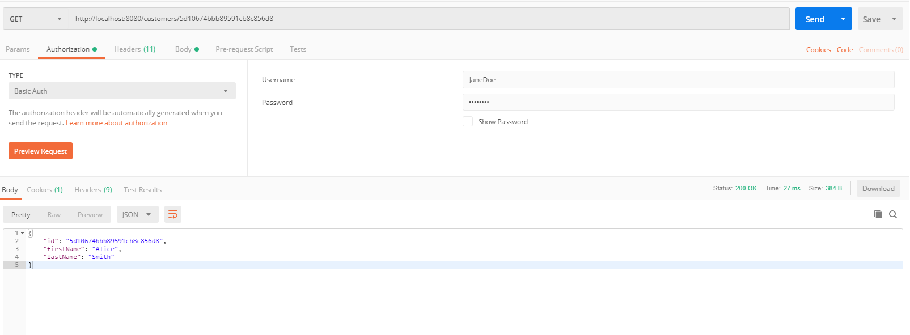

# Readme

This is a spring boot project where we are trying to achieve creating an application which uses **MongoDb** as Database and **Spring Security** to protect the API's from public user.

This is a basic sample application which only covers the minimal concepts. We can create users and give them the access to use the API to get the customer details.

This application doesn't have data by default 
- First we need to create a user
- Then use that credentials to access the API to create customers and access them.
- Or we can manually add data to the database and use that data to login and access the API.

### Screens:

